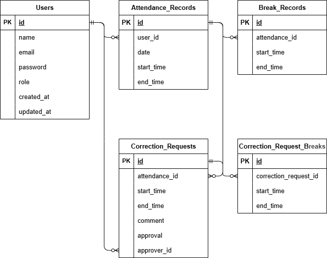

# 勤怠管理アプリ

## 概要

一般ユーザーは出勤・退勤・休憩などの打刻を行うことができます。
管理者は一般ユーザーの管理をすることができるアプリです。

## 環境構築

1. リポジトリをクローンする

```bash
   git clone git@github.com:matsu9889/attendance-management.git
   cd attendance-management
```

2. 環境設定ファイルの作成

```bash
   cp .env.example .env
```

3. ライブラリのインストール

```bash
   composer install
   npm install && npm run build
```

4. Sailを起動する

```bash
   ./vendor/bin/sail up -d
```

5. アプリケーションキーの生成

```bash
   ./vendor/bin/sail artisan key:generate
```

6. データベースの構築

```bash
   ./vendor/bin/sail artisan migrate --seed
```

## 使用技術

- PHP 8.x
- Laravel 10.x
- Laravel Sail（Docker Compose） 2.9
- MySQL 8.x
- Nginx 1.21
- Docker

## ER図



## URL

開発環境
会員登録: http://localhost/register
ログイン: http://localhost/login
勤怠登録画面: http://localhost/attendance
phpMyAdmin: http://localhost:8080/

## テストアカウント

name:管理者
email:admin@example.com
password:password

name:一般ユーザー
email:test@example.com
password:password
